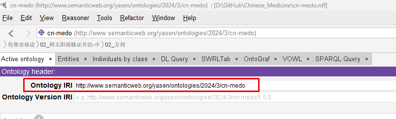
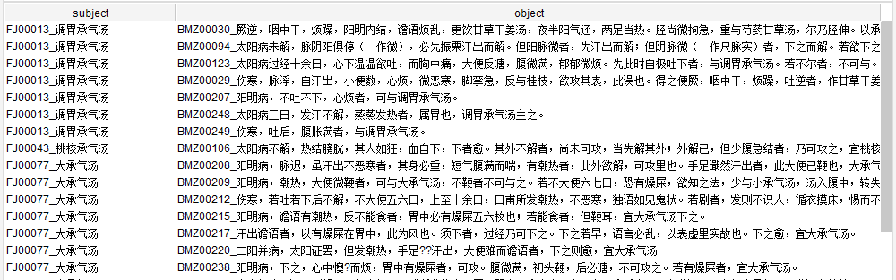
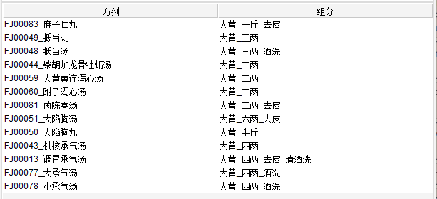

# Query Information from cn-medo (Chinese Medicine Ontology)

This article shows some samples using SPARQL to query data from cn-medo ontology

## Generic Prefixes in SPARQL

```SPARQL
PREFIX rdf: <http://www.w3.org/1999/02/22-rdf-syntax-ns#>
PREFIX owl: <http://www.w3.org/2002/07/owl#>
PREFIX rdfs: <http://www.w3.org/2000/01/rdf-schema#>
PREFIX xsd: <http://www.w3.org/2001/XMLSchema#>
PREFIX medo: <http://www.semanticweb.org/yasen/ontologies/2024/3/cn-medo#>
```

Note: the first 4 lines are the default PREFIX in Protege's SPARQL tab, the last line should be added by yourself and refer to the Ontology IRI (with adding # in the last).

Look for your Ontology's IRI as below screenshot:



## 查询某个特定class下面的全部instance (individual)

使用 `rdf:type` 或者 `a` 是等价的，如下：

```SPARQL
PREFIX rdf: <http://www.w3.org/1999/02/22-rdf-syntax-ns#>
PREFIX owl: <http://www.w3.org/2002/07/owl#>
PREFIX rdfs: <http://www.w3.org/2000/01/rdf-schema#>
PREFIX xsd: <http://www.w3.org/2001/XMLSchema#>
PREFIX m: <http://www.semanticweb.org/yasen/ontologies/2024/3/cn-medo#>
SELECT ?s
	WHERE { ?s rdf:type m:伤寒杂病论_01_辨太阳病脉证并治-上_方剂 . }
```

OR

```SPARQL
PREFIX rdf: <http://www.w3.org/1999/02/22-rdf-syntax-ns#>
PREFIX owl: <http://www.w3.org/2002/07/owl#>
PREFIX rdfs: <http://www.w3.org/2000/01/rdf-schema#>
PREFIX xsd: <http://www.w3.org/2001/XMLSchema#>
PREFIX m: <http://www.semanticweb.org/yasen/ontologies/2024/3/cn-medo#>
SELECT ?s
	WHERE { ?s a m:伤寒杂病论_01_辨太阳病脉证并治-上_方剂 . }
```

都可以得到这个class下面建立的方剂列表。

## 查询特定方剂和其组分

```SPARQL
PREFIX rdf: <http://www.w3.org/1999/02/22-rdf-syntax-ns#>
PREFIX owl: <http://www.w3.org/2002/07/owl#>
PREFIX rdfs: <http://www.w3.org/2000/01/rdf-schema#>
PREFIX xsd: <http://www.w3.org/2001/XMLSchema#>
PREFIX medo: <http://www.semanticweb.org/yasen/ontologies/2024/3/cn-medo#>
SELECT ?subject ?predicate ?object
	WHERE { 
		?subject ?predicate ?object .
		FILTER(?subject = medo:FJ00018_小青龙汤 && ?predicate = medo:includes)
	}
```

Note: use `FILTER` within `WHERE` to target the specific object, use `&&` as logical AND.

Result:

| subject | predicate | object |
| --- | --- | --- |
| FJ00018_小青龙汤 | includes | 干姜_三两 |
| FJ00018_小青龙汤 | includes | 细辛_三两 |
| FJ00018_小青龙汤 | includes | 桂枝_三两_去皮 |
| FJ00018_小青龙汤 | includes | 芍药_三两 |
| FJ00018_小青龙汤 | includes | 麻黄_三两_去节 |
| FJ00018_小青龙汤 | includes | 五味子_半升_洗 |
| FJ00018_小青龙汤 | includes | 半夏_半升_洗 |
| FJ00018_小青龙汤 | includes | 甘草_三两_炙 |

## 使用FILTER和regex来进行模糊查询

示例1：由于方剂中有若干名称中有“承气汤”，如“调胃承气汤”，“大承气汤”，“小承气汤”，下面查询只要含有“承气汤”的方剂和其对应病脉证，以方剂排序：

```SPARQL
PREFIX rdf: <http://www.w3.org/1999/02/22-rdf-syntax-ns#>
PREFIX owl: <http://www.w3.org/2002/07/owl#>
PREFIX rdfs: <http://www.w3.org/2000/01/rdf-schema#>
PREFIX xsd: <http://www.w3.org/2001/XMLSchema#>
PREFIX medo: <http://www.semanticweb.org/yasen/ontologies/2024/3/cn-medo#>

SELECT ?subject ?object
	WHERE { 
		?subject medo:相关病证 ?object .
		FILTER( regex(str(?subject), "承气汤", "i") )
	}
	ORDER BY ?subject
```

部分结果如下：



示例2：列出所有用到某一药材，这里以“大黄”为例，的方剂。由于我们建模时把药材的用量与处理方法也同时放到药材的individual名称中，所以还是要用regex进行模糊匹配 （注意这里也用到了关键字AS进行表头文字的重命名）：

```SPARQL
PREFIX rdf: <http://www.w3.org/1999/02/22-rdf-syntax-ns#>
PREFIX owl: <http://www.w3.org/2002/07/owl#>
PREFIX rdfs: <http://www.w3.org/2000/01/rdf-schema#>
PREFIX xsd: <http://www.w3.org/2001/XMLSchema#>
PREFIX medo: <http://www.semanticweb.org/yasen/ontologies/2024/3/cn-medo#>

SELECT (?subject as ?方剂) (?object as ?组分)
	WHERE { 
		?subject medo:组分 ?object .
		FILTER( regex(str(?object), "大黄", "i") )
	}
	ORDER BY ?object
```

结果如下：



## 使用`COUNT`进行查询的计数

示例1：计算《伤寒杂病论》共有多少种方剂

由于在建模过程中，每个章节（有方剂的）都先建立了一个子目录，所以要加总的话需要进行两层查询，中间引入临时变量。

还需注意的是第一层是individual到class，所以用`rdf:type`连接，第二层是class到class，所以用`rdfs:subClassOf`连接，如下：

```SPARQL
PREFIX rdf: <http://www.w3.org/1999/02/22-rdf-syntax-ns#>
PREFIX owl: <http://www.w3.org/2002/07/owl#>
PREFIX rdfs: <http://www.w3.org/2000/01/rdf-schema#>
PREFIX xsd: <http://www.w3.org/2001/XMLSchema#>
PREFIX medo: <http://www.semanticweb.org/yasen/ontologies/2024/3/cn-medo#>

SELECT (count(?s) as ?total)
	WHERE { 
		?s1 rdfs:subClassOf medo:伤寒杂病论_方剂.
		?s rdf:type ?s1 .
	}
```

结果如下：

```SPARQL
"114"^^<http://www.w3.org/2001/XMLSchema#integer>
```

示例2：查询本草经中某经下面的药材数量

由于两层都是class到class，故皆用`rdfs:subClassOf`连接，如下：

```SPARQL
PREFIX rdf: <http://www.w3.org/1999/02/22-rdf-syntax-ns#>
PREFIX owl: <http://www.w3.org/2002/07/owl#>
PREFIX rdfs: <http://www.w3.org/2000/01/rdf-schema#>
PREFIX xsd: <http://www.w3.org/2001/XMLSchema#>
PREFIX medo: <http://www.semanticweb.org/yasen/ontologies/2024/3/cn-medo#>

SELECT (count(?s) as ?total)
	WHERE { 
		?s1 rdfs:subClassOf medo:神农本草经_下经 .
		?s rdfs:subClassOf ?s1 .
	}
```

---

Update date: 2023/05/12