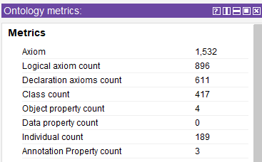

# Chinese_Medicine 中医

Knowledge graph and knowledgebase for Chinese Medicine domain, learn by practicing!

## Overview

Ontology analysis on Traditional Chinese Medicine - TCM (theory, prescription, material, method)

| 本仓库以及相关视频将以中文为主进行中医、中药、方剂等诸方面的本体知识整理，并在整理过程中探讨使用Protege本体编辑器工具的技巧和方法，目标是建立中国传统（其实已经在当世被发扬光大）的中医药知识体系，并能够通过建立起的关系进行灵活的查询。|  |
| :-- | --- |

> 中医学泰斗、国医大师陆广莘说：“以病者之身为宗师”，中医学之道，根本在学人！

对于学习中医的理论著作，下面列写出部分教科书，并会随时补充修订：

1. 基础教材：《中医基础理论》、《中医诊断学》、《中药学》、《方剂学》
2. 经典教材：《内经讲义》（包含：《内经选读》、《伤寒论选读》、《金匮要略》）、《温病学》、《伤寒论讲义》、《金匮要略讲义》
3. 临床教材：《中医内科学》、《中医外科学》、《中医妇科学》、《中医儿科学》、《中医耳鼻喉科学》、《中医眼科学》

Using Protege, below is the snapshot (date: 2023/11/19)

---

## Building up the CN-Medicine Ontology (In Progress)

Ontology Name: [cn-medo.rdf](cn-medo.rdf)

---

## Video links will be published here

- [YouTube](https://www.youtube.com/playlist?list=PL6DEHvciXKeXxvfG6fZzythByHxKzc64G)
- [西瓜视频](https://www.ixigua.com/7303975536609460777?&&id=7303967975441170970)

---

## 参考链接

- [国家药品监督管理局NMPA数据查询](https://www.nmpa.gov.cn/datasearch/home-index.html#category=yp)
- [第二批国家非处方中成药品种使用说明书的通知](https://www.nmpa.gov.cn/wwwroot/zy/zyml.htm): 文件已经下载到[Chinese_Medica_NMPA](/Chinese_Medica_NMPA/)子目录

---

## 本体模型构建日志

| 日期 | 主要内容 |
| --- | :-- |
| 2024/04/02 | 开始全新的cn-medo本体模型构建 |
| 2023/11/26 | 完成《本草纲目》全十卷药品名录结构输入 |
| 2023/11/25 | 增加《本草纲目》（第七卷）药品名称结构 - 木部和菜部 |
| 2023/11/23 | 增加《本草纲目》（第五、六卷）药品名称结构 |
| 2023/11/22 | 增加《本草纲目》（第四卷）药品名称结构 |
| 2023/11/21 | 增加历代朝代结构；继续添加《本草纲目》(第一、二、三卷)各部药品名称；[介绍视频001](https://youtu.be/sqpg4nAkPw0) |
| 2023/11/20 | 构建《本草纲目》各部药品名称结构，与《神农本草经》同名同层的进行关联；测试方剂与组分之间的本地模型方式 |
| 2023/11/19 | 基本结构（人物，著作文献，方剂结构，根据《神农本草经》建构的君臣左使药物名称结构 |

---

希望和大家共同学习探讨，欢迎[邮件联络](mailto:xiaoqizhao@outlook.com)。