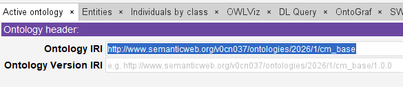
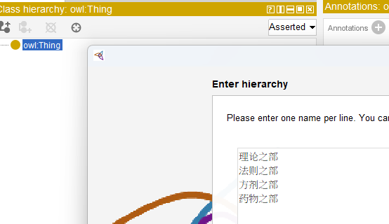
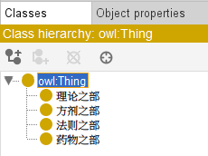

# CM_BASE Ontology - Chinese Medicine Base

- [CM\_BASE Ontology - Chinese Medicine Base](#cm_base-ontology---chinese-medicine-base)
  - [总体目标](#总体目标)
  - [Initial Ontology 本体模型初始化](#initial-ontology-本体模型初始化)
  - [Knowledge Source](#knowledge-source)

## 总体目标

由于中国传统医学知识体系浩如烟海、博大精深，在深入到某一类或某一本具体的典籍分析之前，有必要从一个总览的角度先对中医的基本体系进行底层的知识图谱，也就是本体模型的建模。

这个模型基于秦伯未先生的《中医入门》，对书中的内容逐项进行学习与分析，使用Protege本体编辑器创建一个逻辑完整并自洽的本体模型。

未来，期望能够将此模型作为公共“底座”，支持拓展到其他中医理论的分析与建模，逐步建立越来越丰富的本体模型集。

这个仓库建立的本体模型命名为：

`cm_base = Chinese Medicine Base ontology`

## Initial Ontology 本体模型初始化

Create one RDF/OWL file called [cm_base.rdf](cm_base.rdf)

Ontology IRI: http://www.semanticweb.org/v0cn037/ontologies/2026/1/cm_base



Add `cm` as PREFIX into below SPARQL query headers:

```SQL
PREFIX rdf: <http://www.w3.org/1999/02/22-rdf-syntax-ns#>
PREFIX owl: <http://www.w3.org/2002/07/owl#>
PREFIX rdfs: <http://www.w3.org/2000/01/rdf-schema#>
PREFIX xsd: <http://www.w3.org/2001/XMLSchema#>
PREFIX cm: <http://www.semanticweb.org/v0cn037/ontologies/2026/1/cm_base#>
SELECT ?subject ?object
	WHERE { ?subject rdfs:subClassOf ?object }
```

## Knowledge Source

基于秦伯未先生的《中医入门》，其按照中医的体系，分为理、法、方、药四个部分，这也构成了我们本体模型的第一层的类。

| 主要部分 | 具体内容 |
| --- | --- |
| 理论之部 | 介绍了中医的特点，包括整体观念和辩证论治，阐述了阴阳、五行、经络等基本学说，并对人体的生理、病因进行了讲解，如五脏六腑的功能、十二经脉的分布、气血津液的作用，以及外因、内因、不内外因等病因分类。 |
| 法则之部 | 详细说明了辩证的方法，如表里寒热虚实的判断、六经辩证、三焦辩证等，介绍了望、闻、问、切四诊方法，以及正治和反治、治本和治标、八法等治疗法则。 |
| 方剂之部 | 讲解了方制的相关知识，如君臣佐使的配伍原则、七方的分类、剂型的种类等，并列举了一些基本方剂和处方举例，帮助了解方剂的组成和应用。 |
| 药物之部 | 介绍了中药的采集和炮制方法，讲解了药性的气味、效能、归经等知识，以及药物的配伍、用量等使用方法。 |

基于此，使用class hierarchy tool，建立第一层的四个类：





