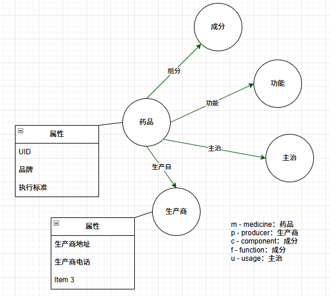

# 中药知识图谱数据库

- [中药知识图谱数据库](#中药知识图谱数据库)
  - [Meta-Model (Version 1)](#meta-model-version-1)
  - [导入药品名录](#导入药品名录)
  - [导入药品成分列表](#导入药品成分列表)
  - [导入功能](#导入功能)
  - [导入主治（用途）](#导入主治用途)

## Meta-Model (Version 1)



## 导入药品名录

```sql
LOAD CSV WITH HEADERS FROM 'file:///D:/github/Chinese_Medicine/cn-med-kg/csv/1-namelist.csv' AS row
MERGE (m:Medicine { UID: row.UID })
SET
    m.name = row.`药品名称`,
    m.brand = row.`品牌`,
    m.standard= row.`执行标准`
MERGE (p:Producer { name: row.`生产商` })
SET
    p.address = row.`生产商地址`,
    p.telephone = row.`生产商电话`
MERGE (m)-[r1:PRODUCED_BY]->(p)-[r2:PRODUCES]->(m)
ON CREATE SET
    m.createdAt = datetime(),
    p.createdAt = datetime()
ON MATCH SET
    m.updatedAt = datetime(),
    p.updatedAt = datetime()
RETURN m, p, r1, r2
```

## 导入药品成分列表

```sql
LOAD CSV WITH HEADERS FROM 'file:///D:/github/Chinese_Medicine/cn-med-kg/csv/2-component.csv' AS row
MERGE (c:Component { name: row.`成分` })
WITH row, c
MATCH (m:Medicine)
WHERE m.UID = row.`药品ID`
MERGE (m)-[r:INCLUDES]->(c)
ON CREATE SET c.createdAt = datetime()
ON MATCH SET c.updatedAt = datetime()
RETURN m, c, r
```

A Small Optimization

If your Medicine nodes have a unique property or index on UID (which they should for performance), you can simplify the MATCH by putting the property directly in the pattern, which is often more idiomatic:

```sql
LOAD CSV WITH HEADERS FROM 'file:///D:/github/Chinese_Medicine/cn-med-kg/csv/2-component.csv' AS row
MERGE (c:Component { name: row.`成分` })
WITH row, c
MATCH (m:Medicine { UID: row.`药品ID` })
MERGE (m)-[r:INCLUDES]->(c)
ON CREATE SET c.createdAt = datetime()
ON MATCH SET c.updatedAt = datetime()
RETURN m, c, r
```

## 导入功能

```sql
LOAD CSV WITH HEADERS FROM 'file:///D:/github/Chinese_Medicine/cn-med-kg/csv/3-function.csv' AS row
MERGE (f:Function { name: row.`功能` })
WITH row, f
MATCH (m:Medicine { UID: row.`药品ID` })
MERGE (m)-[r:PERFORMS]->(f)
ON CREATE SET f.createdAt = datetime()
ON MATCH SET f.updatedAt = datetime()
RETURN m, f, r
```

## 导入主治（用途）

```sql
LOAD CSV WITH HEADERS FROM 'file:///D:/github/Chinese_Medicine/cn-med-kg/csv/4-usedfor.csv' AS row
MERGE (u:Usage { name: row.`主治` })
WITH row, u
MATCH (m:Medicine { UID: row.`药品ID` })
MERGE (m)-[r:USED_FOR]->(u)
ON CREATE SET u.createdAt = datetime()
ON MATCH SET u.updatedAt = datetime()
RETURN m, u, r
```