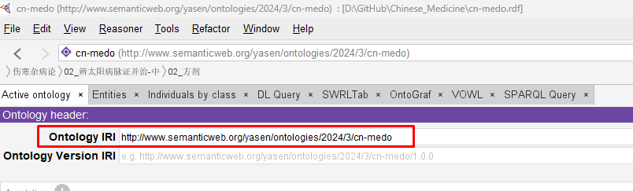

# Query Information from cn-medo (Chinese Medicine Ontology)

This article shows some samples using SPARQL to query data from cn-medo ontology

## Generic Prefixes in SPARQL

```SPARQL
PREFIX rdf: <http://www.w3.org/1999/02/22-rdf-syntax-ns#>
PREFIX owl: <http://www.w3.org/2002/07/owl#>
PREFIX rdfs: <http://www.w3.org/2000/01/rdf-schema#>
PREFIX xsd: <http://www.w3.org/2001/XMLSchema#>
PREFIX medo: <http://www.semanticweb.org/yasen/ontologies/2024/3/cn-medo#>
```

Note: the first 4 lines are the default PREFIX in Protege's SPARQL tab, the last line should be added by yourself and refer to the Ontology IRI (with adding # in the last).

Look for your Ontology's IRI as below screenshot:



## Use cases with Query Samples

### 查询特定方剂和其组分

```SPARQL
PREFIX rdf: <http://www.w3.org/1999/02/22-rdf-syntax-ns#>
PREFIX owl: <http://www.w3.org/2002/07/owl#>
PREFIX rdfs: <http://www.w3.org/2000/01/rdf-schema#>
PREFIX xsd: <http://www.w3.org/2001/XMLSchema#>
PREFIX medo: <http://www.semanticweb.org/yasen/ontologies/2024/3/cn-medo#>
SELECT ?subject ?predicate ?object
	WHERE { 
		?subject ?predicate ?object .
		FILTER(?subject = medo:FJ00018_小青龙汤 && ?predicate = medo:includes)
	}
```

Note: use `FILTER` within `WHERE` to target the specific object, use `&&` as logical AND.

Result:

subject             predicate   object
FJ00018_小青龙汤	includes	干姜_三两	
FJ00018_小青龙汤	includes	细辛_三两	
#FJ00018_小青龙汤	includes	桂枝_三两_去皮	
FJ00018_小青龙汤	includes	芍药_三两	
FJ00018_小青龙汤	includes	麻黄_三两_去节	
FJ00018_小青龙汤	includes	五味子_半升_洗	
FJ00018_小青龙汤	includes	半夏_半升_洗	
FJ00018_小青龙汤	includes	甘草_三两_炙

