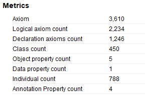
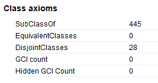
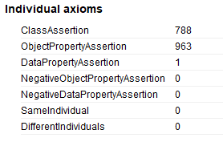

# Dairy of Modeling CN-MEDO 中医本体建模随记

## 2024/05/12 完成了《伤寒杂病论》的建模

《伤寒杂病论》中的病脉证与方剂是我这个中医本体的第一个大的概念输入，从三月份的着手准备到今天，将近两个月的时间，终于把全部《伤寒杂病论》的内容过了一遍。

这个[cn-medo-20240125](archive/cn-medo-20240512.rdf)的版本是完成的snapshot。

这个版本中的各项本体指标如下：

| Metrics | Classes | Individuals |
| --- | --- | --- |
|  |  |  |

为了对《伤寒杂病论》中的病脉证与方剂进行建模，先期我将《神农本草经》的上中下三经进行了建模，并以其为class建立了对应的药材实现`组分`的关系。

有关主要概念的建模数量如下：

- 伤寒杂病论
  - 病脉证：
- 神农本草经
  - 上经：145味药材
  - 中经：114味药材
  - 下经：104味药材